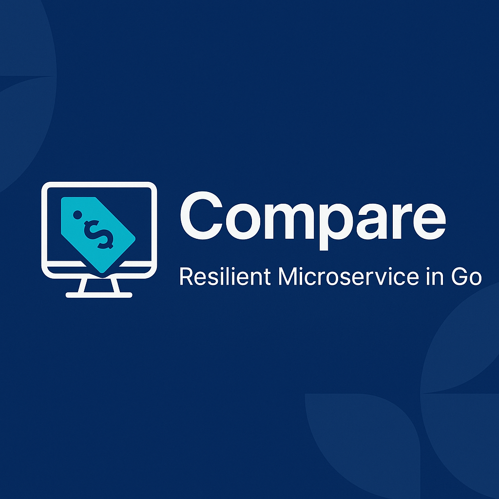

# Compare — Resilient Microservice

Backend resiliente para comparação de preços com múltiplas fontes externas.

## 🚀 Objetivo do Projeto

O objetivo do projeto Compare é permitir que um usuário compare o preço de produtos em diferentes mercados, ajudando-o a tomar decisões de compra mais inteligentes.  
O usuário poderá:

- Comparar o preço de um produto específico entre mercados.
- Montar uma lista de compras e comparar o valor total em diferentes mercados.
- Receber resultados confiáveis mesmo quando fontes externas (APIs de mercados) forem instáveis ou lentas.

Este projeto é um laboratório prático para desenvolver expertise em **patterns de resiliência aplicados em microsserviços escritos em Go**, com foco em:

- **Retry com backoff e jitter**
- **Circuit breaker nas chamadas a fornecedores**
- **Idempotência nas requisições do cliente**
- **Observabilidade completa (logs estruturados, métricas, traces)**
- **Fila de processamento para scraping/busca de preços com DLQ**

## 🏗️ Arquitetura

O Compare será desenvolvido seguindo os princípios da **Hexagonal Architecture (Ports & Adapters)**:

```plaintext
cmd/compare/                 Entry point
app/adapter/inbound/         Entrada (ex: REST handler)
app/adapter/outbound/        Integração com APIs de fornecedores, fila, observability
app/domain/model/            Modelos de domínio (Produto, Comparacao, etc)
app/domain/service/          Lógica de negócio (ComparadorService)
app/port/inbound/            Interfaces de caso de uso (ex: ComparadorUseCase)
app/port/outbound/           Interfaces para fornecedores, fila, observability
docs/                        Documentação de arquitetura e fluxos
.github/workflows/           CI/CD pipelines (GitHub Actions)
```

## 🛠️ Stack Tecnológica

- **Linguagem:** Go
- **Arquitetura:** Hexagonal Architecture (Ports & Adapters)
- **Infraestrutura:** AWS (SQS, DLQ, eventualmente DynamoDB/S3 se necessário)
- **Observabilidade:** Logs estruturados, métricas Prometheus, tracing com OpenTelemetry
- **CI/CD:** GitHub Actions

## 🎯 Patterns que serão implementados

✅ Retry com backoff e jitter
✅ Circuit breaker nas chamadas a fornecedores
✅ Idempotência nas requisições do cliente
✅ Observabilidade completa (logs estruturados, métricas, traces)
✅ Fila de processamento para scraping/busca de preços com DLQ

## 📍 Status

Projeto em desenvolvimento — **Semana 1 (setup inicial + retry básico em fornecedor dummy).**

## 👩‍💻 Objetivo Pessoal

Este projeto está sendo desenvolvido como parte de um plano de estudo e execução com foco em:

- Dominar **patterns de resiliência em microsserviços com Go**.
- Construir um projeto de portfólio com engenharia de backend robusta e de mercado.
- Consolidar práticas de arquitetura hexagonal em projetos reais.

---

**Desenvolvido por [Greicy Santos](https://github.com/greicy-santos-dev).**
